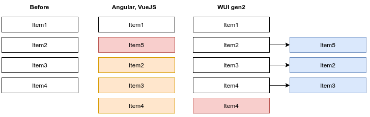
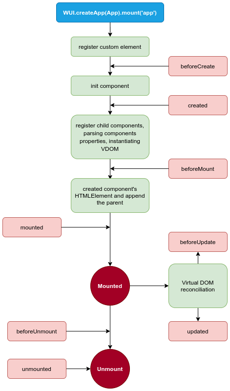

# Web Framework (WF) with virtual DOM implementation

On this page:

* <a href="#introduction">Introduction</a>
* <a href="#demo-application">Demo Application</a>
* <a href="#performance-comparison">Performance Comparison</a>
* <a href="#getting-started">Getting Started</a>
* <a href="#lifecycle-hooks">Lifecycle Hooks</a>
* <a href="#lifecycle-diagram">Lifecycle Diagram</a>
* <a href="#template-syntax">Template Syntax</a>
    * <a href="#components">Components</a>
    * <a href="#nested-components">Nested Components</a>
    * <a href="#reusing-components">Reusing Components</a>
    * <a href="#props">Props</a>
        * <a href="#passing-static-or-dynamic-props">Passing Static or Dynamic Props</a>
        * <a href="#one-way-data-flow">One-Way Data Flow</a>
        * <a href="#emitting-data-from-the-child-to-the-parent-component">Emitting Data From The Child To The Parent Component</a>
        * <a href="#prop-casing-camelcase-vs-kebab-case">Prop Casing (camelCase vs kebab-case)</a>
    * <a href="#components-composition">Components Composition</a>
        * <a href="#slot">Slot</a>
        * <a href="#slot-fallback">Slot Fallback</a>
        * <a href="#named-slots">Named Slots</a>
        * <a href="#conditional-rendering-slot">Conditional rendering Slot</a>
* <a href="#interpolations">Interpolations</a>
    * <a href="#text">Text</a>
    * <a href="#raw-html">Raw HTML</a>
    * <a href="#attributes">Attributes</a>
    * <a href="#javascript-expressions">Javascript Expressions</a>
* <a href="#conditional-rendering">Conditional Rendering</a>
    * <a href="#directive-if">Directive :if</a>
    * <a href="#directive-else">Directive :else</a>
* <a href="#event-handling">Event Handling</a>
    * <a href="#listening-to-events">Listening To Events</a>
* <a href="#list-rendering">List Rendering</a>
    * <a href="#rendering-an-array-elements-with-for-directive">Rendering an Array elements with :for directive</a>
    * <a href="#directive-for-with-an-object">Directive :for with an Object</a>


The modern web applications are based on reusable HTML elements which allows to decrease a development time of applications, to decrease complexity of the Javascript/Typescript code, to simplify a maintain code of the application. Because these reusable HTML elements encapsulate all logic implementation which are responsible for the binding custom component's properties with HTML template, providing conditional rendering of the elements and particulars rendering all necessary changes.

With WF web developer creates a **new HTML tags**, extends an existing HTML tags or extends already created custom components. The browser gives us an excellent tool for structuring web applications, because it use so called HTML language. This language is not so difficult to learning and using. It has also an excellent documentation, well supported, portable, declarative. But its vocabulary is limited. That's why sometimes developer requires to extend existing one HTML element or, often, create a new one with a specific requirements.


## Introduction

Before starting to learn a **WF** we highly recommend to read an official specification of the [Web components](https://developer.mozilla.org/en-US/docs/Web/Web_Components). The **WF** is own implementation of the three main technologies which are inherits by Web Components:

- **Custom elements**: A set of JavaScript APIs that allow you to define custom elements and their behavior, which can then be used as desired in your user interface.
- **Shadow DOM**: A set of JavaScript APIs for attaching an encapsulated "shadow" DOM tree to an element — which is rendered separately from the main document DOM — and controlling associated functionality. In this way, you can keep an element's features private, so they can be scripted and styled without the fear of collision with other parts of the document.
- **HTML templates**: The ```<template>``` and ```<slot>``` elements enable you to write markup templates that are not displayed in the rendered page. These can then be reused multiple times as the basis of a custom element's structure.

Another good tutorial about Web components you can find reading a number of excellent articles by [Eric Bidelman](https://developers.google.com/web/resources/contributors/ericbidelman). He is a Google engineer and he's great tutorial [Custom Elements v1: Reusable Web Components](https://developers.google.com/web/fundamentals/web-components/customelements) explains and clarifies the mostly all important and crucial things, implemented in our library.  

## Demo application

You can find a real demo application, base on this framework [Here](https://web-virtual-dom.vercel.app).

## Performance comparison

This topic is very important, because every approaches have strongest and weakness sides, different functionality might be implemented with a different features, and, of course, thats influence on the performance. Often inefficient implementation of the one part could make a in overall great application inconvenient for the user. Based on the our last experience, we have no doubts, that the most difficult and crucial parts of the application is work with array of the data, lists and various tables. That's why implementation of the rendering iterable elements in every framework should perform fastest as much as possible. We provided different cases to insertion and deletion a 1000 items in a list with the same algorithm. Initially table has a 4 items, then we will add or delete an additional items:

**Chrome Browser**

Library                             | WF                  | Angular v.11    | VueJS v3          | Svelte v3
:-----                              | :----               | :-----          | :----             | :----
Insertion from 0, 1000 items        |   73-85 ms          |   210-220 ms    |  780-790 ms       |  200 ms
Deletion from 0, 1000 items, ms     |   45-50 ms          |   220-230 ms    |  75-80 ms         |  60 ms
Insertion from 2, 1000 items, ms    |   73-85 ms          |   225-235 ms    |  720-730 ms       |  190 ms
Deletion from 2, 1000 items, ms     |   51-55 ms          |   235-240 ms    |  75-79 ms         |  62 ms
Appending 1000 items, ms            |   95-105 ms         |   215-220 ms    |  85-95 ms         |  200 ms
Deletion last 1000 items, ms        |   51-52 ms          |   235-240 ms    |  75-79 ms         |  65 ms

**Firefox**

Library                             | WF                  | Angular v.11    | VueJS v3         | Svelte v3
:-----                              | :----               | :-----          |  :----           | :----
Insertion from 0, 1000 items        |   75-85 ms          |   82-86 ms      |  1680-1707 ms    |  77-79 ms
Deletion from 0, 1000 items, ms     |   28-36 ms          |   32-38 ms      |  36-42 ms        |  32-36 ms
Insertion from 2, 1000 items, ms    |   76-78 ms          |   64-71 ms      |  1520-1730 ms    |  72-76 ms
Deletion from 2, 1000 items, ms     |   34-38 ms          |   30-38 ms      |  35-39 ms        |  24-29 ms
Appending 1000 items, ms            |   77-78 ms          |   77-78 ms      |  75-77 ms        |  72 ms
Deletion last 1000 items, ms        |   35-40 ms          |   45-48 ms      |  37-40 ms        |  33 ms

As a result **WF** engine has a great performance during working with iterable items, especially in the Chrome/Brave browser. We did some investigations to found out the most effective algorithm with insertion the nodes inside the DOM model. The most modern framework for inserting new records to the list of data or tables, just made insertion of the new DOM node inside the existed DOM model. And in case if table has a lot of items that leads to overload the browser engine and decreases overall performance of application. **WF** uses another algorithm: each existed node will be appended with a new data, in other words, at first we provide a reconciling data an existing nodes in the DOM and at the end **WF** will append the table all necessary items. As a result such reconciling makes a shifting data to end of the table. That works much faster. That's interesting, the same algorithm also uses SvelteJS, but in the Chrome it works much slower in comparing with **WF**, instead in the Firefox it works slightly faster. In our opinion VueJS has a bug, because during inserting data entire the table it works very slow in any browser, insertion of 5000 items in the Firefox took 42 seconds! 



## Getting Started

The best way to know what is **WF** is try out to run the [Hello World example]. In the **WF** an application composed from one or more [Components](#markdown-header-components). Each component is a reusable self-contained block of code. This code encapsulates HTML, CSS and Typescript/Javascript and could be placed in one or in the multiple files. In this way, the simplest application always contain an initialization/start script and one component.

**index.ts:**

```javascript
import { WF } from "@core";
import App from "./app.component";

WF.createApp(App).mount('app');
```

**app.component.ts:**

```javascript
    import { BaseComponent, Component } from '@core';

    @Component {
      tag: 'app-component',
      template: '<div>Hello World!</div>'
    }
    export default class AppComponent extends BaseComponent {}
```

And that's it!

## Lifecycle Hooks

Each component instance has own initializations steps when it's created. For example, it needs a component registration, compile the template, to set up observation components properties, mount the instance to the **DOM**, and then update the **DOM** when data changes. During this procedure of the component instantiating, it also runs functions called **lifecycle hooks**, giving a developer an opportunity to add his own specific code to the each step of this process.

For example, often we use **onMounted** hook for initializing some objects after when component will created and mounted to the **DOM**:

```javascript
    import { BaseComponent, Component } from '@core';

    @Component {
      tag: 'app-component',
      template: '<div>Hello World!</div>'
    }
    export default class AppComponent extends BaseComponent {
      @Prop() items = ["orange", "mango", "banana", "sugar", "tea"];

	    onMounted() {
		    this.items = this.items.splice(2, 0, "water");
	    }
    }
```


There are also other hooks which might be called on a different stages of the component's lifecycle, such as onBeforeCreated, created or beforeUnmount. All lifecycle hooks are called with their this context pointing to the current active instance invoking it. 

Hook                  | Type      | Details
:-----                | :----     | :-----        
**beforeCreate**      | function  | Called synchronously immediately after the instance has been initialized, before data observation and template setup.
**created**           | function  | Called synchronously after the instance is created.  In this stage component is already registered, initialized shadowDOM and bind a rendering function. Also web engine perform a parsing component's properties and instantiated a component Virtual DOM.
**beforeMount**       | function  | Called right before the mounting begins: the render function is about to be called for the first time.
**mounted**           | function  | Called after the instance has been mounted. In this stage reconciliation performed at the first time.
**beforeUpdate**      | function  | Called when data changes, before the DOM is reconciled. This is a good place to access the existing DOM before an update, e.g. to remove manually added event listeners. This is an excellent place for the time rendering measurement.
**updated**           | function  | Called after a data change causes the virtual DOM to be reconciled and re-rendered. This stage is guaranteed that the component was re-rendered.
**beforeUnmount**     | function  | Called right before an instance of the component is unmounted and destroyed. At this stage the instance is still fully functional.
**unmounted**         | function  | Called after an instance of the component has been unmounted and destroyed.    

## Lifecycle Diagram

Below is a diagram of the component lifecycle. It's not required to understand deep all steps on this diagram, but sometimes it might be helpful to organize your component's code in a better way:



## Template Syntax

**WF** uses an HTML-based template syntax which allows you to bind component's properties ([Typescript class fields](https://www.typescriptlang.org/docs/handbook/classes.html)) with DOM rendered elements. All WF templates are valid HTML and might be parsed by all modern browsers (spec-compliant browsers). Currently WF is tested with [Chrome browser](https://www.google.com/chrome/), started from version 67 and latest versions of the [Mozilla Firefox](https://mozilla-firefox.en.softonic.com/).

Entirety, WF translates HTML templates into **Virtual DOM** render functions. Since WF is fully written in Typescript it supports natively Typescript class-syntax, interfaces and decorators. Typescript Decorators is used for simplify the implementation of components props and allows to add component's tag, specify component's  HTML template, set run the component in [Shadow DOM](https://developer.mozilla.org/en-US/docs/Web/Web_Components/Using_shadow_DOM). Also component's decorator uses for specifying the nested (children) components, which might be using in the parent component.


### Components

As we already mentioned **WF** fully written on Typescript and component's syntax uses all benefits of an object-oriented approach, where classes inherit functionality and objects are built from these classes. Starting with ECMAScript 2015, also known as ECMAScript 6, JavaScript programmers can build their applications using this object-oriented class-based approach. WF uses these techniques and each simply component inherits from the parent **BaseComponent** class:

```javascript
    import { BaseComponent, Component, Prop } from '@core';

    @Component {
      tag: 'simple-component',
      template: '<span>Custom message: {{ message }}</span>'
    }
    export default class SimpleComponent extends BaseComponent {
      @Prop message = '<strong>HELLO</strong>';
    }
```
The syntax of the components is very similar to C# or Java. So, in case if we're already familiar with one of these programming languages, it will be not so difficult to use such syntax approach. 

For proper registering a component, it will always be given a name. Parameter **tag** is responsible for that. For example, this component uses name ```simple-component```, in this case in the DOM it will be represent as a custom tag:

```html
    <simple-component></simple-component>
```
When using a component directly in the DOM wi strongly recommend following the [W3C rules](https://html.spec.whatwg.org/multipage/custom-elements.html#valid-custom-element-name) for custom names:

1. All lowercase;
2. Contains a hyphen (i.e., has multiple words connected with the hyphen symbol).

That allows t avoid conflicts with the current and future HTML elements.

This **SimpleComponent** declares the property message. The decorator **@Prop** is uses for binding data from the application's business logic and view. Such approach supports developing with using of ready to use components or extend their functionality. 


### Nested Components

With **WF** we have the ability to use any nested custom components in an easiest way. For this purpose we should declare nested components by an optional parameter of the **@Component** decorator ```components```:

```javascript
    import { BaseComponent, Component, Prop } from '@core';
    import { NestedComponent1, NestedComponent2 } from '@components';

    @Component {
      tag: 'simple-component',
      template: '
        <span>Custom message: {{ message }}</span>
        <nested-component-1></nested-component-1>
        <div>Some logic</div>
        <nested-component-2></nested-component-2>
      ',
      components: [ NestedComponent1, NestedComponent2 ]
    }
    export default class SimpleComponent extends BaseComponent {
      @Prop message = '<strong>HELLO</strong>';
    }
```

### Reusing Components

Components can be reused as many times as you want:

```javascript
    import { BaseComponent, Component, Prop } from '@core';
    import { NestedComponent1 } from '@components';

    @Component {
      tag: 'simple-component',
      template: '
        <nested-component-1></nested-component-1>
        <nested-component-1></nested-component-1>
        <nested-component-1></nested-component-1>
        <nested-component-1></nested-component-1>
      ',
      components: [ NestedComponent1 ]
    }
    export default class SimpleComponent extends BaseComponent {}
```

### Props

The component has the ability to interpolate its properties to the html template. For this purpose framework provides a directive **Prop()**. After changes of the properties which are used a directive **Prop()** will be rendered automatically on the page. At the same time, **WF** offers a two-way data flow between the parent component and its child components. 

#### Passing Static or Dynamic Props

Each custom child components have the ability to accept an input parameters from the own parent component. For example we can pass a string like a static value, like this:

```html
    <parent-component>
      <child-component :title="Very cool component"></child-component>
    </parent-component>
```
The **title** is a some **Prop()** property in the child component.

Also, it is possible to bind any output parent's component property with any an input property in the child component. In this case, the parent component shares some data with **all** its child components. After changing some output parent parameters, all child components will be notified about that and it’s observable input parameters will be updated automatically. So, the child component always watches about an input changing.

```html
    <parent-component>
      <child-component :title="childTitle"></child-component>
    </parent-component>
```
Again, **title** is a **Prop()** property in the child component, and **childTitle** is a **Prop()** property from the parent component. It is possible to bind a different input variables with the same property from the parent component:

```html
    <parent-component>
      <child-component :title="childTitle"></child-component>
      <child-component :title="anotherTitle"></child-component>
      <child-component :title="andThirdTitle"></child-component>
    </parent-component>
```
**WF** works like a **VueJS**: all input parameters always observable. We should not implement something special in the child component for that.

#### One-Way Data Flow

All binding properties has a **one-way binding** form between the child property and the parent one: when the parent property updates, it will flow down to the child, but not the other way around. This prevents child components from accidentally mutating the parent's state, which can make your app's data flow harder to understand.

In addition, every time the parent component is updated, all props in the child component will be refreshed with the latest value. This means you should not attempt to mutate a prop inside a child component.

#### Emitting Data From The Child To The Parent Component

Each child components have the ability to pass some data in opposite way, to the parent component. For that purposes **WF** offers so called an **emitting** functionality. In this case, each child component has its own custom event subscription to its parent component. At the same time, the parent component has observable methods, which might accept the emitted data from the child component. This is a crucial detail, because a parent component might have multiple the same child components and  during emitting data the parent component should know exactly, from which child component it received the data.

Let me show a simple example from the project tests:

```javascript
    @Component({
      tag: `child-component-1`,
      useShadow: false,
      template: `
        <div id="1">Result: {{ var1 }}</div>`,
    })
    class Child1Component1 extends BaseComponent {
      @Prop() var1 = 100;

      onMounted() {
        this.emit('setRow', 1000);
      }
    }
    
    @Component({
      tag: `parent-component-1`,
      useShadow: false,
      template: `
      <div>
        <div id="2">Result: {{ var2 }}</div>
        <child-component-1 @setRow="emitCallback"></child-component-1>
      </div>`,
      components: [ Child1Component1 ]  
    })
    class ParentComponent extends BaseComponent {
      @Prop() var2 = 10;
      
      emitCallback(data) {
        this.var2 = data;
      }
    }
```

In this case, the parent component has **emitCallback** method and ready to accept any data object from the child component. **setRow** is an emit action or name of the custom event. After receiving data and updating the property **var2** all changes will be rendered automatically. 

A slightly more complex example will show, how to implement a **two-way** data flow with passing data from the parent component to the child and back with emitting data from the child component to its parent. Let's modify a little bit the previous example:

```javascript
    @Component({
      tag: `child-component-1`,
      useShadow: false,
      template: `
        <div id="1">{{ var1 }}</div>,
        <div id="2">Result: {{ input2 }}</div>
      `,
    })
    class Child1Component1 extends BaseComponent {
      @Prop() var1 = 100;
      @Prop() input2 = 0;

      onMounted() {
        this.emit('setRow', 1000);
      }
    }
    
    @Component({
      tag: `parent-component-1`,
      useShadow: false,
      template: `
      <div>
        <div id="2">Result: {{ parentVariable }}</div>
        <child-component-1 :parent-variable="input2" @setRow="emitCallback"></child-component-1>
      </div>`,
      components: [ Child1Component1 ]  
    })
    class ParentComponent extends BaseComponent {
      @Prop() parentVariable = 10;
      
      emitCallback(data) {
        this.parentVariable = data;
      }
    }
```

#### Prop Casing (camelCase vs kebab-case)

HTML attribute names are case-insensitive, so browsers will interpret any uppercase characters as lowercase. That means when you're using in-DOM templates, camelCased prop names need to use their kebab-cased (hyphen-delimited) equivalents:

```javascript
    @Component({
      tag: `parent-component-1`,
      useShadow: false,
      template: `
      <div>
        <child-component-1 :parent-variable="input2" @setRow="emit-callback"></child-component-1>
      </div>`,
      components: [ Child1Component1 ]  
    })
    class ParentComponent extends BaseComponent {
      @Prop() parentVariable = 10;
      
      emitCallback(data) {
        this.parentVariable = data;
      }
    }
```


### Components Composition

#### Slot

In case if the component will be used with **Shadow DOM** mode we have a great possibility to use Web Components ```<slot>``` technology. That makes the component more flexible and development process more creative. We can make it possible to display different text in each element instance in a nice declarative way using the ```<slot>``` element. 

For example:

```html
    <parent-component>
      <child-component>
        <span slot>Let's have some different text!</span>
      </child-component>
    </parent-component>

    <child-component>
      <slot>Some default text</slot>
    </child-component>
```
So, in this case, during runtime ```Some default text``` text will be rendered as ```Let's have some different text!```. 

#### Slot Fallbacks

A component can specify **fallbacks** for any slots that are left empty, by putting content inside the slot element:

```html
    <child-component>
      <slot>
        <em>no content was provided</em>
      </slot>
    </child-component>
```

Now we can create an instances of the ```child-component``` without any children:

```html
    <parent-component>
      <child-component>
        Let's have some different text!
      </child-component>
    </parent-component>
```

#### Named Slots

The previous example shows how we can use **default** slot in the component, which is renders the direct children of a component. There are times when it' useful to have a multiple slots. In this case we could control the places of the rendered content inside the children component. For these cases, the ```<slot>``` element has a special attribute, name, which can be used to assign a unique ID to different slots so you can determine where content should be rendered:

```html
    <child-component>
      <slot name="header">Some default header</slot>
      <slot></slot>
      <slot name="footer">Some default footer</slot>
    </child-component>

    <parent-component>
      <child-component>
        <span slot="header">Some header</span>
        <span>Some content</span>
        <span slot="footer">Some footer</span>
      </child-component>
    </parent-component>
```

A ```<slot>``` outlet without name implicitly has the name "default".

#### Conditional Rendering Slot

**WF** is a flexible framework. Of course, the can specify a conditional expression for rendering of the ```<slot>`` in the parent component as well as in the children component.

```html
    <parent-component>
      <child-component>
        <span :if="isEnabled" slot>Let's have some different text!</span>
      </child-component>
    </parent-component>

    <child-component>
      <slot :if="isEnabled">Some default text</slot>
    </child-component>
```

Keep in mind, that above example contains the property **isEnabled** from the different components, so actually these are different properties from the different contexts.

## Interpolations

### Text

The **WF** HTML templates uses so called "Mustache" syntax (double curly braces):

```html
    <span>Custom message: {{ message }}</span>
```

Expression which is used entire the curly braces can use any number of spaces characters or without them. During translations of the HTML template **WF** engine will replace this mustache tag with property from the correspondent component instance. It also will be updated (rendered) whenever the ```message``` property changes. 

Also it is possible to perform one-time interpolations of any component's property by using the ```:once``` node directive. In this case, web engine do not update on data change. 

```html
    <span :once>This message will never change: {{ message }}</span>
```
Please, keep in mind this will also affect any other bindings on the same node. 


### Raw HTML

Current implementation of the **WF** double mustache allows to render native HTML tags from the property. So, for instance, such code:

```javascript
    import { BaseComponent, Component, Prop } from '@core';

    @Component {
      tag: 'simple-component',
      template: '<span>Custom message: {{@html message}}</span>'
    }
    export default class SimpleComponent extends BaseComponent {
      @Prop message = '<strong>HELLO</strong>';
    }
```

Will be rendered on the screen as: 

Custom message: **HELLO**. 

The content of the ```span``` will be replaced with the value of message property, all HTML tags in ```message``` interpreted with plain HTML tags. 

Please, keep in mind dynamically rendering HTML code can be dangerous because it can lead to [XSS vulnerability](https://en.wikipedia.org/wiki/Cross-site_scripting). 


### Attributes

For binding component's property with node attributes we do not use the mustache. Instead, use a bind ```:``` directive:

```html
    <div :id="dynamicId"></div>
```
In case of using static attributes, we have the ability to make a flexible way to mix a static and dynamic attributes. For example:

```javascript
    import { BaseComponent, Component, Prop } from '@core';

    @Component {
      tag: 'simple-component',
      template: '<div class="class1" :class="customClass" :style="customStyle"></div>'
    }
    export default class SimpleComponent extends BaseComponent {
      @Prop customClass = 'class2';
      @Prop customStyle = 'width: 100px';
    }
```
Template will translate into:

```html
    <div class="class1 class2" style="width: 100px"></div>
```

### Javascript Expressions

Besides using a property data from the component **WF** support full power of **Javascript expressions** inside all data bindings:

```html
  {{ (var1 - var2)/2 + 1  }}

  {{ ok ? 'YES' : 'NO' }}
```
In such case WF engine will bind a component property data with an HTML template. Each binding can only contain one single expression, so the following will NOT work:

```html
  <!-- this is a statement, not an expression: -->
  {{ let number = 1 }}

  <!-- flow control won't work either, use ternary expressions -->
  {{ if (ok) { return message } }}
```
Of course, we can use Javascript expressions as logic during dynamically build an attributes:

```html
  <div id="1" 
    style="opacity: 1;" 
    :style="{{ var1 !== var2 ? 'width: 10px; height: 20px;' : 'width: 20px;' }}"
    class="class3" 
    :class="{{ var1 !== var2 ? 'class1' : 'class2' }}"
  >Result: {{ (var1 - var2)/2 +1 }}</div>
```


## Conditional Rendering

### Directive :if

The directive ```:if``` is used to conditionally rendering of node or a separate block. The block will only be rendered in case of the truthy value in the expression.

```html
    <div :if="isEnabled">Great conditional element</div>
```

Since the ```isEnabled``` property has a boolean type it is possible to use it with in inverted way with exclamation symbol before.

```html
    <div :if="!isEnabled">Inverted conditional element</div>
```

### Directive :else

It is also possible to add an "else" block by directive ```:else```. This block should be next node in the template. In case if parent node with ```:if``` expression will be rendered, the next ```:else``` block will be disappear. Otherwise, in case if the ```:if``` will contain a false value the next ```:else``` block will be rendered.

```html
    <div :if="isEnabled">Great conditional element</div>
    <div :else>Or the second one</div>
```


## Event Handling

### Listening to Events

**WF** uses ```@``` directive to listen DOM events and run some methods from the component. For example:

```javascript
    import { BaseComponent, Component, Prop } from '@core';

    @Component {
      tag: 'simple-component',
      template: '<div @click="handler" @dblclick="otherHandler"></div>'
    }
    export default class SimpleComponent extends BaseComponent {

      handler() {
        ...some logic
      }

      otherHandler() {
        ...some logic
      }
    }
```

## List Rendering

### Rendering an Array elements with :for directive

The directive **:for** is used to render a list of items based on an array. For using such approach we should use a special syntax in the form of ```item in items```, where items is the array source data and item is an **alias** for the array element: 

```javascript 
    @Component({
      tag: `list-component`,
      useShadow: false,
      template: `
        <div>
          <div :for="item in items" class="list">
            {{ item }} 
          </div>
        </div>`,
    })
    class ListComponent extends BaseComponent {
      @Prop() items = ['Item1', 'Item2', 'Item3', 'Item4', 'Item5'];
    }
```
As a result: 

```html
  Item1
  Item2
  Item3
  Item4
  Item5
```

Inside **:for** blocks we have full access to parent scope properties. 

```javascript 
    @Component({
      tag: `list-component`,
      useShadow: false,
      template: `
        <div>
          <div :for="item in items" class="list">
            <div>
              Value is {{ item.id }} {{ item.title }} {{ item.child.id }}
            </div>
          </div>
        </div>`,
    })
    class ListComponent extends BaseComponent {
      @Prop() items = [ 
        {id: '0', title: 'Item1', child: { id: 'child1'}}, 
        {id: '1', title: 'Item2', child: { id: 'child2'}}, 
        {id: '2', title: 'Item3', child: { id: 'child3'}}, 
        {id: '3', title: 'Item4', child: { id: 'child4'}}, 
      ];
    }
```
As a result: 

```html
  Value is 0, Item1, child1
  Value is 1, Item2, child2
  Value is 2, Item3, child3
  Value is 3, Item4, child4
  Value is 4, Item5, child5
```

### Directive :for with an Object

It is possible to use **:for** to iterate through the properties of an object:

```javascript 
    @Component({
      tag: `list-component`,
      useShadow: false,
      template: `
        <div>
          <div :for="i in item" class="list">
            <div>
              {{ i }}
            </div>
          </div>
        </div>`,
    })
    class ListComponent extends BaseComponent {
      @Prop() item = {
        title: 'How to do lists in WF',
        author: 'John Smith',
        publishedAt: '2021-03-12'
      }
    }
```
As a result: 

```html
  How to do lists in WF
  John Smith
  2021-03-12
```
